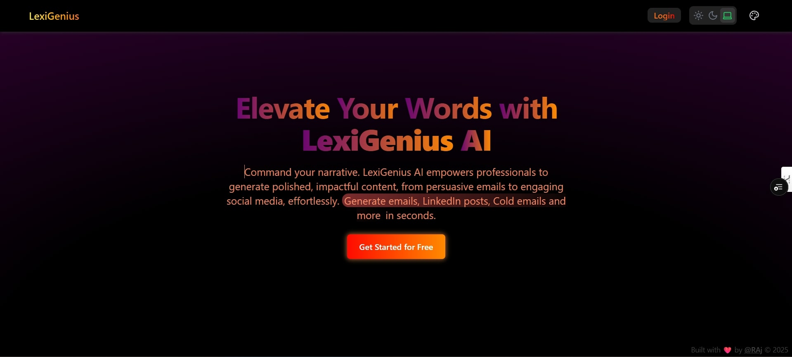
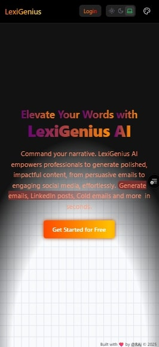

# LexiGenius - AI-Powered Writing Assistant

<p align="center">
  
</p>

<p align="center">
  <strong>Your intelligent writing partner for clear, professional, and impactful content.</strong>
</p>

<p align="center">
  
  
  
  
</p>

---

LexiGenius is a comprehensive AI-powered writing assistant designed to streamline your content creation process. Whether you're drafting emails, writing blog posts, or generating social media content, LexiGenius provides the tools you need to produce high-quality text in a fraction of the time.

## ✨ Key Features

-   **🤖 Advanced Content Generation:**
    -   Choose from a wide range of templates like emails, LinkedIn posts, product descriptions, and more.
    -   The AI understands context and generates relevant, coherent, and high-quality content.

-   **🎨 Customizable Tone & Style:**
    -   Fine-tune the generated text by selecting from various tones (Formal, Humorous, Persuasive, etc.) and lengths.
    -   Ensure your content aligns perfectly with your brand's voice and audience.

-   **💬 Interactive AI Chatbot:**
    -   Engage in a conversation with our AI chatbot for quick answers, brainstorming, or to get help with your writing.

-   **🗂️ Persistent History:**
    -   Automatically saves your generated content, allowing you to revisit and reuse it at any time.
    -   Your history is tied to your account, so you can access it from any device.

-   **📊 Customizable Dashboard:**
    -   A flexible, grid-based dashboard that you can personalize to your workflow.
    -   Add, remove, and resize widgets like the content generator and chatbot.

-   **📱 Progressive Web App (PWA):**
    -   Install LexiGenius on your desktop or mobile device for a fast, reliable, and engaging app-like experience.

-   **🔐 Secure Authentication:**
    -   User authentication is handled securely through Firebase, with support for email/password and Google Sign-In.

-   **🌓 Light & Dark Mode:**
    -   A sleek, modern interface with both light and dark themes to reduce eye strain.

## 🖼️ Screenshots

<p align="center">
  
  <br>
  <em>LexiGenius on a laptop, showcasing the customizable dashboard.</em>
</p>

<p align="center">
  
  <br>
  <em>LexiGenius on a mobile device, demonstrating its responsive design.</em>
</p>

## 🛠️ Tech Stack

| Category       | Technology                                                                              |
| -------------- | --------------------------------------------------------------------------------------- |
| **Framework**  | [Next.js](https://nextjs.org/)                                                          |
| **Language**   | [TypeScript](https://www.typescriptlang.org/)                                           |
| **Styling**    | [Tailwind CSS](https://tailwindcss.com/)                                                |
| **Auth**       | [Firebase Authentication](https://firebase.google.com/docs/auth)                        |
| **Database**   | [Firestore](https://firebase.google.com/docs/firestore)                                 |
| **PWA**        | [next-pwa](https://www.npmjs.com/package/next-pwa)                                      |
| **Animation**  | [Framer Motion](https://www.framer.com/motion/)                                         |
| **UI**         | [React Grid Layout](https://github.com/react-grid-layout/react-grid-layout), [Shadcn/ui](https://ui.shadcn.com/) |

## 📂 Project Structure

```
lexigeniusAI-main/
├── public/                 # Public assets (images, icons, manifest.json)
├── src/
│   ├── app/                # Next.js App Router
│   │   ├── api/            # API routes
│   │   ├── auth/           # Authentication pages
│   │   ├── dashboard/      # Dashboard pages
│   │   └── ...             # Other pages and layouts
│   ├── components/         # Reusable React components
│   │   ├── ui/             # UI components (buttons, cards, etc.)
│   │   └── ...
│   ├── lib/                # Helper functions, libraries, and configurations
│   │   ├── firebase.ts     # Firebase configuration
│   │   └── ...
│   └── middleware.ts       # Next.js middleware for authentication
├── .env.local              # Environment variables
├── next.config.ts          # Next.js configuration
└── ...
```

## 🚀 Getting Started

### Prerequisites

-   Node.js (v18 or later)
-   npm or yarn

### Installation & Setup

1.  **Clone the repository:**
    ```bash
    git clone https://github.com/CodewithEvilxd/lexigenius.git
    cd lexigenius
    ```

2.  **Install dependencies:**
    ```bash
    npm install
    ```

3.  **Set up Firebase:**
    -   Go to the [Firebase Console](https://console.firebase.google.com/) and create a new project.
    -   Enable **Authentication** (with Google provider) and **Firestore**.
    -   In your project settings, get your Firebase configuration keys.

4.  **Set up environment variables:**
    Create a `.env.local` file in the root of your project and add your configuration keys:

    ```env
    # Get this from your OpenRouter account
    OPENROUTER_API_KEY=your_openrouter_api_key

    # Get these from your Firebase project settings
    NEXT_PUBLIC_FIREBASE_API_KEY=your_firebase_api_key
    NEXT_PUBLIC_FIREBASE_AUTH_DOMAIN=your_firebase_auth_domain
    NEXT_PUBLIC_FIREBASE_PROJECT_ID=your_firebase_project_id
    NEXT_PUBLIC_FIREBASE_STORAGE_BUCKET=your_firebase_storage_bucket
    NEXT_PUBLIC_FIREBASE_MESSAGING_SENDER_ID=your_firebase_messaging_sender_id
    NEXT_PUBLIC_FIREBASE_APP_ID=your_firebase_app_id
    NEXT_PUBLIC_FIREBASE_MEASUREMENT_ID=your_firebase_measurement_id
    ```

5.  **Run the development server:**
    ```bash
    npm run dev
    ```

    The application will be available at [http://localhost:3000](http://localhost:3000).

## 🚢 Deployment

This application is optimized for deployment on the [Vercel Platform](https://vercel.com/).

-   Push your code to a Git repository (GitHub, GitLab, Bitbucket).
-   Import your project into Vercel.
-   Add your environment variables in the Vercel project settings.
-   Vercel will automatically build and deploy your application.

## 🤝 Contributing

We welcome contributions! If you have ideas for new features or improvements, please open an issue or submit a pull request.

## 📄 License

This project is licensed under the MIT License. See the [LICENSE](LICENSE) file for more details.